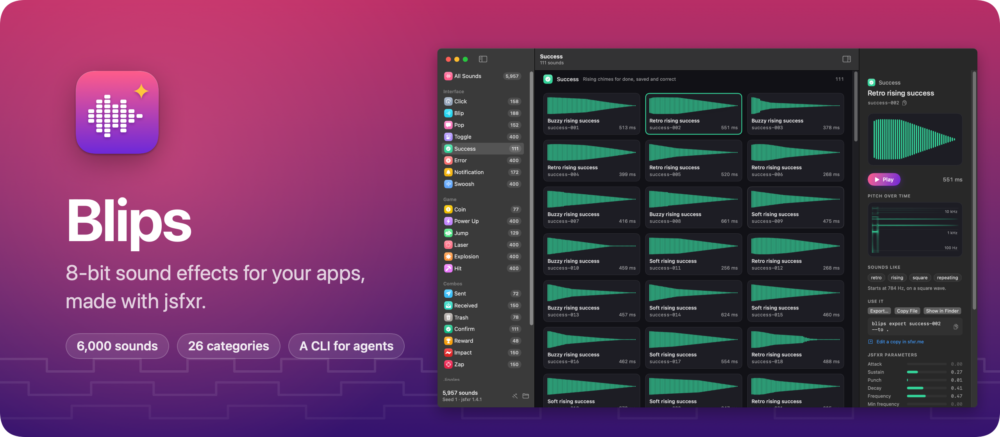
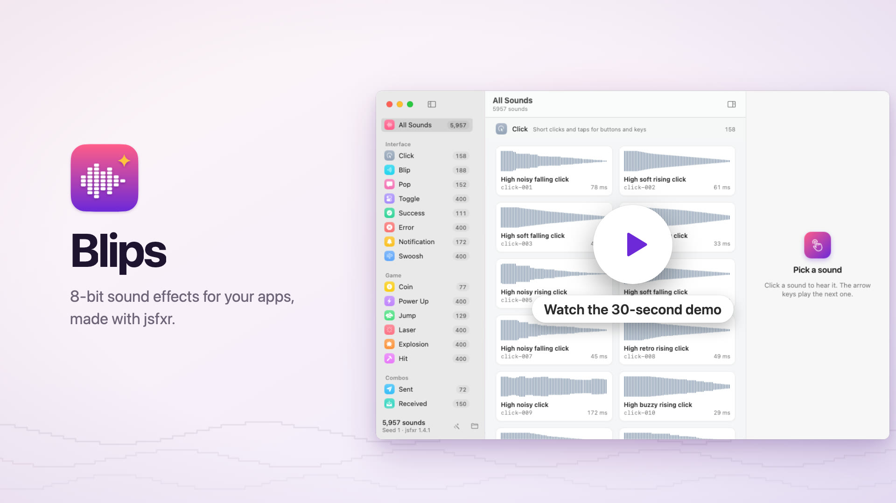
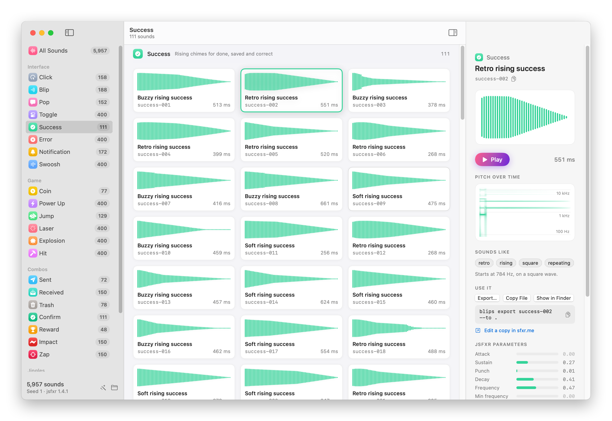

Blips is a Mac app and a command line tool with about 6,000 8-bit sound effects for your apps and games: clicks, toggles, success chimes, errors, notifications and swooshes, game sounds like coins and lasers, combos like a message sent, and short jingles like a victory fanfare or a countdown. Click a sound to hear it, then drag its WAV file into your project.

I make a lot of small apps, and I wanted sounds for them that I could pick in a minute, or that an AI coding agent could pick for me. Blips makes them with [jsfxr](https://github.com/chr15m/jsfxr), the JavaScript port of DrPetter's [sfxr](https://www.drpetter.se/project_sfxr.html), and keeps only the sounds that are clearly different from each other, so you don't scroll through fifty copies of the same blip.

Watch the 30-second demo:

[](https://flaviocopes.com/images/blips/demo.mp4)

## Download

Get `Blips-1.1.0.zip` from the [latest release](https://github.com/flaviocopes/blips/releases/latest), unzip it, and drag Blips to your Applications folder. It runs on macOS 14 Sonoma or later, on Apple silicon and Intel Macs.

The first time you open it, click **Generate the Library**. Blips makes every sound on your Mac, which takes less than half a minute, and they take about 300 MB.

### Opening it the first time

Blips is signed with my Apple Developer ID and notarized by Apple. The first time you open it, macOS asks if you're sure you want to open an app downloaded from the internet. Click **Open**.

On a work laptop you might not be able to install apps in `/Applications`. You can keep Blips in the `Applications` folder inside your home folder instead.

### Updates

Once a day, Blips asks GitHub whether there's a newer version. When there is, it shows what's new, and **Install and Relaunch** puts it in place of the old one. **Blips → Check for Updates…** checks right away.

To turn off the daily check, run this in Terminal:

```sh
defaults write com.flaviocopes.blips AppUpdaterAutomaticChecks -bool false
```

## How to use it

The sidebar has 26 categories in four groups:

- **Interface**: click, blip, pop, toggle, success, error, notification and swoosh.
- **Game**: coin, power up, jump, laser, explosion and hit.
- **Combos**, two sounds stacked or one after the other: sent (a swoosh into a pop), received, trash, confirm, reward, impact and zap.
- **Jingles**, short tunes on a scale: fanfare, game over, countdown, startup and alarm.

Click a sound to play it. The arrow keys move to the next one and play it, so you can go through a category quickly, and Space plays or stops.

<picture>
  <source media="(prefers-color-scheme: dark)" srcset="docs/screenshot-dark.png" />
  
</picture>

The inspector on the right shows the selected sound: its waveform, its pitch over time, tags like `soft`, `retro` or `rising`, and the jsfxr parameters it was made from, drawn like the sliders in jsfxr's editor. For a combo it shows the two sounds it's made of, and you can click each one to hear it alone. For a jingle it shows the notes.

To use a sound:

- Drag it into the Finder or into an Xcode project, and you get its WAV file.
- Press ⌘C to copy the file, or ⌘E to save it with another name, like `saved.wav`.
- Right-click it to copy its ID or the command that exports it, show it in the Finder, or open it in [sfxr.me](https://sfxr.me) to make a variation.
- Right-click a category in the sidebar to export all of its sounds into a folder.

The sounds are yours to use in anything you make, free or commercial, with no credit needed.

## Every sound is different

jsfxr makes random sounds, and random sounds repeat themselves. Blips rolls each category's sounds one after the other and keeps a roll only when it's clearly different from every sound already in the category. It compares a fingerprint of each sound: its pitch over time, its loudness over time, how tonal or noisy it is, and its length. The bar is about a different note and jump for two chimes, or a different wave. The same chime a whole tone higher doesn't count.

A category ends after 400 sounds, or when it runs out of new ones, so categories have different sizes: 77 coins, 111 success chimes, 400 explosions.

## The same sounds on every Mac

Every sound comes from a seed, so `success-003` is the same sound on every Mac, and you can write down which sound an app uses by its ID. The library comes out byte for byte the same on Apple silicon and Intel.

Want a whole different set? **Library → Generate…** has **New Sounds**, which picks a random seed, and **Seed…** to get back to one you noted down. The same ID names a different sound in a library from another seed, so the sidebar shows which seed you're on.

## Pick sounds with AI agents

Blips has a command line tool, `blips`, so an agent like Claude Code, Cursor or Codex can find sounds for the app you're building and copy them in. Set it up from the **Blips** menu:

1. **Install Command Line Tool…** links `blips` into `~/.local/bin`.
2. **Install Agent Skill…** copies a skill to `~/.agents/skills/blips` and links it for Claude Code, Cursor and Codex, so they know when and how to use the command.

Then ask an agent something like "add a sound when a note is saved, and one when it's deleted". Here's what it runs:

```sh
blips list --category success --tag soft --json
blips play success-003 success-005
blips export success-003 --to Resources/Sounds --name saved.wav
blips export trash-012 --to Resources/Sounds --name deleted.wav
```

The agent can't hear the sounds, so it picks a few and asks you to listen with `blips play` or in the app. `export --format m4a` converts a sound with `afconvert`, and `blips show success-003` prints its file, tags and jsfxr parameters. Run `blips help` for every command, and `blips capabilities --json` for the manifest agents read.

## Privacy

Blips keeps the sounds on your Mac, in `~/Library/Application Support/Blips`. Once a day, it asks GitHub whether there's a newer version of Blips, and it downloads one only when you click **Install and Relaunch**. It opens sfxr.me in your browser only when you ask it to. There are no accounts.

## How it works

jsfxr is JavaScript, so Blips runs it inside JavaScriptCore, the JavaScript engine built into macOS, and nothing needs Node. Before every call it replaces `Math.random` with a seeded generator, so a seed always rolls the same sound and renders the same noise. Each sound is mastered to the same loudness, and saved as a 16-bit WAV file next to a `library.json` that keeps its jsfxr parameters, which paste unchanged into sfxr.me.

The hard part was making every Mac agree. The generator decides whether to keep a sound by comparing a distance with a threshold, and the system's math functions round differently in the last digit on Intel and Apple silicon. That's enough to flip one decision and change the rest of a category, so everything the generator computes uses plain arithmetic, with its own `sin`, `cos`, `log2` and `exp2`.

## Build it from source

You need macOS 14 or later and Swift 6.2, which comes with Xcode 26.

```sh
swift run BlipsApp
```

To build the release zip, run:

```sh
./Scripts/build-release.sh
```

It builds a universal app in `dist/Blips.app`, with the `blips` command inside, and zips it into `dist/`. With my Developer ID certificate in the keychain it signs and notarizes the app. Everywhere else it signs it ad hoc, so your copy is signed ad hoc. A copy you build yourself opens without a warning on your Mac.

If you send it to another Mac, macOS says it "could not verify Blips is free of malware". Click **Done**, then go to **System Settings → Privacy & Security** and click **Open Anyway**, or remove the quarantine flag in Terminal:

```sh
xattr -dr com.apple.quarantine /Applications/Blips.app
```

## Development

```sh
swift test                                  # the core tests
swift run blips help                        # the command line tool
./Scripts/build-app.sh                      # dist/Blips.app, without the zip
swift Scripts/render-icon.swift             # the app icon
./Scripts/screenshot.sh "$HOME/Library/Application Support/Blips"   # docs/screenshot-light.png and -dark.png
swift Scripts/render-banner.swift           # docs/banner.png, from docs/screenshot-dark.png
./Scripts/update-jsfxr.sh 1.4.1             # vendor another jsfxr version from npm
```

Working with an AI coding agent? Point it at [AGENTS.md](AGENTS.md). It has the commands and the rules to follow.

## License

[MIT](LICENSE). jsfxr and riffwave.js, which Blips includes in `Sources/BlipsCore/JSFXRSource.swift`, are in the public domain.
